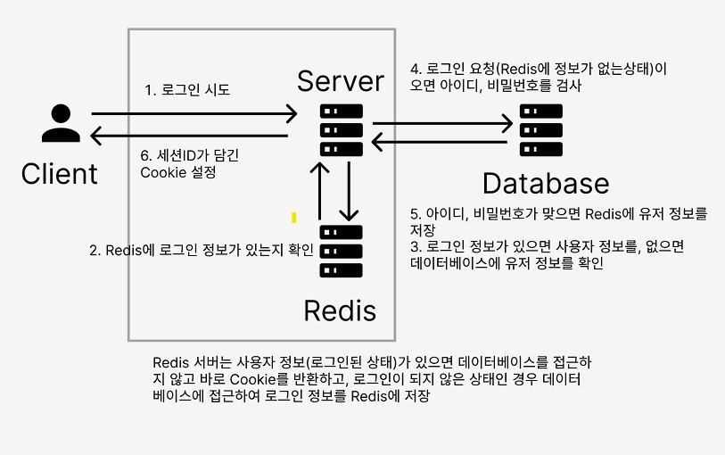
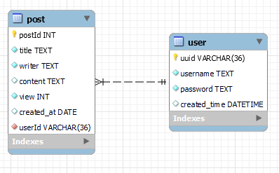

## 목표
`golang`을 이용하여 웹서비스를 구현하는것이 목표입니다.
## 프론트엔드 깃 주소
[프론트엔드](https://github.com/hotkimho/go-Client)
## 기술 스택
### Backend
언어 : golang

프레임워크 : 없음(golang 내장 라이브러리)

database : mysql

etc : redis

### Frontend
언어 : javascript

프레임워크 : react

## Todo
- [X] 회원가입
- [X] 로그인
- [X] 게시판
  - [X] 글 쓰기
  - [X] 글 삭제
  - [X] 글 수정
  - [ ] 조회 수 (Redis를 이용하면 최적화 가능)
- [ ] 댓글
  - [X] 댓글 쓰기
  - [ ] 댓글 삭제
  - [ ] 댓글 수정
  
`구현 목록은 더 추가될 예정입니다.`

## Backend
### 사용자 인증

`in memory` 기반의 Redis를 이용한 세션 로그인으로 구성되었습니다.

로그인된 경우 서버에서 직접 조회, 아닌 경우 데이터베이스에 사용자 정보를 확인하여 로그인 합니다.

### ERD

### 인증 API
`(로그인 검증)`문구는 로그인을 검사하는 미들웨어를 포함하고 있습니다.
- POST
  - `/auth/signup` 회원가입
    - 유저 정보를 `Body`로 받으며, 입력된 정보로 회원가입을 진행합니다.
  - `/auth/login` 로그인
    - 유저 정보를 `Body`로 받으며, `Database`의 정보와 비교하여 로그인을 진행합니다. 로그인이 되면 Redis에 정보를 저장합니다.
- GET
  - `/auth/logout` 로그아웃(로그인 검증)
    - `Redis`에 사용자 정보를 삭제하며, `세션ID`가 저장된 쿠키를 삭제합니다.

### 게시판 API
- GET
  - `/board` 게시글 페이지 조회
    - `page`값을 Qeury로 받으며, 해당하는 페이지의 게시글 목록 넘겨줍니다.
  - `/board/post` 게시글 ID 조회
    - 'postId`값을 Query로 받으며, 해당 ID에 맞는 게시글의 정보를 넘겨줍니다.
- POST
  - `/board/post` 게시글 생성(로그인 검증)
    - 게시글에 대한 데이터를 `Body`로 받으며, 입력된 데이터로 게시글을 생성합니다.
- DELETE
  - `/board/post` 게시글 삭제(로그인 검증)
    - 삭제할 게시글 정보인 `postId`값을 Query로 받으며, 해당 게시글을 삭제합니다.
- PATCH
  - `/board/post` 게시글 수정(로그인 검증)
    - 게시글에 대한 데이터를 `Body`로 받으며, 입력된 데이터로 게시글을 수정합니다.

## 부족한 점
`nodejs`로 구현을 먼저 해봐서 그런지 비슷한 방식으로 코드를 작성했다.

- 추상화가 잘 되어 있는가?
  - No, 좀더 공부하여 추상화를 구현해보자
- 중복된 내용이 많은가?
  - Yes, 데이터 베이스를 사용한 코드가 중복된 부분이 많았다. 추상화를 제대로 하며 데이터베이스에 접근 하는 영역은 따로 분리하도록 리팩토링 하자
- 기능을 꾸준히 추가할 예정
  - 현재는 댓글 기능을 추가하자
- Backend를 공부하다보니 Frontend 코드는 그때 그때 기능구현에만 집중되어 있다. 최소한 ContextAPI는 배워서 상태를 관리하자
